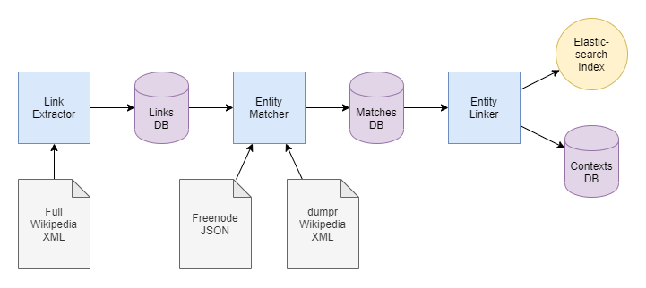

### Introduction

Knowledge graphs represent entities and their relationship to each other as a graph. The graph's nodes represent entities like *"Angela Merkel"* and *"Germany"*. The graph's directed edges represent relations between entities like *"is chancellor of"* which holds true for *"Angela Merkel"* and *"Germany"* as of 2020.

There are well maintained knowledge graphs for general knowledge as described in Wikipedia, for example. For specific domains, however, there are rarely comprehensive knowledge graphs because of the high effort to create them. However, the domain-specific entities are often known and there are large amounts of unstructured data such as texts describing the entities and their relationships.

This is referred to as an *open world scenario*: A knowledge graph exists for the known *closed world entities* and the relations between them. In addition, there are the known *open world entities*, whose relations are unknown. However, these relations can be derived from the existing, unstructured data that describes the open world entities.

### Project Scope

This project provides tools for setting up a baseline model that follows a primitive approach to predict an open world entity's triples: It looks up the closed world entity most similar to the open world entity using Elasticsearch, which uses TF-IDF as a measure of similarity, and assumes that the closed world entity's triples also apply to the open world entity. For example, if *"Emmanuel Macron"* is an open world entity whose most similar closed world entity is *"Angela Merkel"* for who the relation *"has profession"* towards the entity *"politician"* is true, the model assumes that this also applies to *"Emmanuel Macron"*.

Furthermore, the project contains an evaluation framework for comparing other models to the baseline, tools for running a grid search to find the best hyperparameters to train these models, as well as a browser UI that allows browsing the data.

### Setup

1. Make sure that you have at least 150GB of free disk space.

2. Clone the repository and mark the scripts as executable: <br>
   ```
   ~$ git clone https://gitlab.cs.hs-rm.de/tuhma001/sentence-sampler.git
   ~$ chmod +x sentence-sampler/bin/*.sh
   ```

3. Put `deepca` next to the `sentence-sampler` clone.
   ```
   ~$ ls
   deepca/
   sentence-sampler/
   ```

4. Optionally, set up a local Python environment. Run the following
   commands to set up a local Anaconda environment: <br>
   ```
   ~/sentence-sampler$ conda create -p ./envs python=3.7
   ~/sentence-sampler$ conda activate ./envs
   ```

5. Install the dependencies, including `deepca` from its editable
   source: <br>
   ```
   ~/sentence-sampler$ pip install -r requirements.txt
   ~/sentence-sampler$ pip install -e ../deepca
   ```

6. By default the data files are expected to be in a `data/`
   subdirectory:
   ```
   ~/sentence-sampler$ ls data/
   entity2wikidata.json
   enwiki-2018-09.full.xml
   enwiki-latest-pages-articles.xml
   ```

7. Set up Elasticsearch.

<hr> <!-- TODO -->

```
conda create -p conda/ python=3.8
conda activate conda/
pip install -e ../deepca/
pip install -r ../deepca/requirements/all.txt
pip install -e ../ryn/
pip install -r ../ryn/requirements.txt
pip install -r requirements.txt
python -m spacy download en_core_web_lg
```

# Overview

Currently, the sentence sampler consists of the following components:

- The `LinkExtractor` creates a link graph from a full Wikipedia dump
  and stores it in the links database.
- The `EntityMatcher` searches a pre-processed Wikipedia dump for
  Freebase entities. To minimize false positives (e.g. find the movie
  "2012" in many unrelated articles), entities are only searched in
  articles linked to their main article. The entity's occurrences
  are stored in the matches database.
- The `EntityLinker` determines how closely entities are linked to each
  other by comparing their contexts. In particular, it splits the
  entity matches' contexts into training and test contexts, stores
  the training contexts in Elasticsearch and subsequently queries 
  Elasticsearch for the contexts that best match the held out test 
  contexts.



### Build the Baseline Model

Essentially, the baseline model consists of the closed world knowledge graph and the Elasticsearch index that stores text contexts for all the closed world entities. The knowledge graph must be given. This section shows how to build the Elasticsearch index. At the same time, contexts for the open world entities are sampled as well. They are stored in a database and are used later for prediction.

To be able to sample the text contexts of an entity, first the mentions of the entity in Wikipedia must be found. An entity can be described with different words. For example "Angela Merkel" could be mentioned by her name or as "the chancellor". For the text search we use the Wikidata label of the entity as well as all the link texts that are used to link the entity's Wikipedia article from other articles. We limit our search to adjacent Wikipedia articles because the search terms' meaning will often vary on distant Wikipedia articles. To know which articles are adjacent we build a link graph in the first step.

Thus, from start to finish, building the baseline model includes the following steps:
1. Build the link graph
2. Find an entity's matches in it's corresponding Wikipedia article and the adjacent articles
3. Sample contexts for the matches
4. Optionally, conduct a test experiment to verify the contexts' expressiveness
5. Concatenate the closed world entities' contexts and store them in the Elasticsearch index
6. Concatenate the open world entities' contexts and store them in a database


# Usage

1. Create the link graph.
   ```
   ~/sentence-sampler/bin$ ./link-extractor --page-limit 1000
   Applied config:
       Wikipedia XML        ../data/enwiki-latest-pages-articles.xml
       Links DB             ../data/links.db
       In memory            False
       Commit frequency     10000
       Page limit           1000

   20:08:21 | COMMIT
   20:08:21 | 0 <page>s | 0 redirects | 0 links | 0 missing text
   20:08:27 | 1,000 <page>s | 267 redirects | 177,191 links | 0 missing text
   20:08:27 | COMMIT
   20:08:27 | DONE
   ```

2. Match the Freebase entities. <br>
   ```
   ~/sentence-sampler/bin$ ./entity-matcher --doc-limit 1000
   Applied config:
      Freebase JSON        ../data/entity2wikidata.json
      Wikipedia XML        ../data/enwiki-2018-09.full.xml
      Links DB             ../data/links.db
      Matches DB           ../data/matches.db
      In memory            False
      Commit frequency     1000
      Doc limit            1000

   Missing URLs: 23
   20:11:21 | COMMIT
   20:11:21 | 0 Docs | Anarchism | 682 neighbors | 194 matches
   20:11:21 | 1 Docs | Autism | 335 neighbors | 32 matches
   20:11:21 | 2 Docs | Albedo | 114 neighbors | 31 matches
   ...
   20:11:48 | 999 Docs | Action Against Hunger | 1 neighbors | 0 matches
   20:11:48 | COMMIT
   20:11:48 | 1,000 Docs | AW | 1 neighbors | 0 matches
   20:11:48 | DONE
   ```

3. Analyse how closely the entity matches' contexts are linked:
   ```
   ~/sentence-sampler/bin$ ./entity-linker --limit-entities 10
   Applied config:
       Matches DB           ../data/matches.db
       Limit entities       10
       Context size         1000
       Limit contexts       None

   QUERY  political philosophy  'is a  that advocates self-governed societies based on voluntary institutions. These are often descri'
   -------------------------------------------------------------------
    174.9  anarchism             'Federations.\n\nPlatformism is a tendency within the wider anarchist movement based on the organisatio'
    161.4  philosophy            'Archibald Ogden, who threatened to quit if his employer did not publish it. While completing the nov'
    137.1  democracy             '(under the Law and Justice Party) to the Philippines (under Rodrigo Duterte).\n\nIn a Freedom House re'
    126.3  socialism             "lacking international recognition, remained in continuous existence until 1990.\n\nThe Polish People's"
    116.2  communism             'party until Lee Myung-bak won the presidential election of 2007.\n\nThe meaning of "conservatism" in t'
    113.0  ethics                'the nature of the mind and the  of creating artificial beings endowed with human-like intelligence w'
    109.4  government            'of the "Bundesrat" represent the s of the sixteen federated states and are members of the state cabi'
    100.7  Europe                'argued that political fragmentation (the presence of a large number of an states) made it possible f'
     98.5  German                'become Weimar Classicism.\n\nWeimar Classicism ( “"Weimarer Klassik"” and “"Weimarer Klassizismus"”) i'
     97.8  Soviet Union          'in Somino to the north (located in the Braslaw county of the Wilno Voivodeship); Manczin River to th'
   
   ...
   
     0 /  30 political philosophy           #     2 anarchism                       2 philosophy                      2 democracy                       2 socialism                     
    28 / 310 philosophy                     #    28 philosophy                     22 Aristotle                      19 ethics                         17 Plato                         
    32 / 350 anarchism                      #    32 anarchism                      31 democracy                      31 socialism                      28 communism                     
     4 /  70 French Revolution              #     5 government                      5 German                          5 Europe                          5 Paris                         
     3 /  30 libertarianism                 #     3 anarchism                       3 libertarianism                  2 socialism                       2 democracy                     
     0 /  20 Jesus Christ                   #     2 Christianity                    2 Catholic Church                 2 Latin                           2 Greek                         
     0 /  20 English Civil War              #     2 England                         2 World War II                    2 Paris                           1 American Revolutionary War    
     0 /  10 Roundhead                      #     1 anarchism                       1 French Revolution               1 English Civil War               1 philosophy                    
     0 /  10 Jean-Jacques Rousseau          #     1 anarchism                       1 French Revolution               1 English Civil War               1 philosophy                    
     1 /  20 Karl Marx                      #     2 economics                       2 Europe                          2 German                          1 Karl Marx                     
   ```

# Scripts

## Link Extractor

```
usage: link-extractor.py [-h] [--wikipedia-xml WIKIPEDIA_XML] [--links-db LINKS_DB] [--in-memory]
                         [--commit-frequency COMMIT_FREQUENCY] [--page-limit PAGE_LIMIT]

Create the link graph

optional arguments:
  -h, --help                           show this help message and exit
  --wikipedia-xml WIKIPEDIA_XML        path to Wikipedia XML (default: "../data/enwiki-latest-pages-articles.xml")
  --links-db LINKS_DB                  path to links DB (default: "../data/links.db")
  --in-memory                          build complete links DB in memory before persisting it (default: False)
  --commit-frequency COMMIT_FREQUENCY  commit to database every ... pages (default: 10000)
  --page-limit PAGE_LIMIT              terminate after ... pages (default: None)
```

## Entity Matcher

```
usage: entity-matcher.py [-h] [--freebase-json FREEBASE_JSON] [--wikipedia-xml WIKIPEDIA_XML] [--links-db LINKS_DB]
                         [--matches-db MATCHES_DB] [--in-memory] [--commit-frequency COMMIT_FREQUENCY]
                         [--doc-limit DOC_LIMIT]

Match the Freebase entities (considering the Wikipedia link graph)

optional arguments:
  -h, --help                           show this help message and exit
  --freebase-json FREEBASE_JSON        path to Freebase JSON (default: "../data/entity2wikidata.json")
  --wikipedia-xml WIKIPEDIA_XML        path to Wikipedia XML (default: "../data/enwiki-2018-09.full.xml")
  --links-db LINKS_DB                  path to links DB (default: "../data/links.db")
  --matches-db MATCHES_DB              path to matches DB (default: "../data/matches.db")
  --in-memory                          build complete matches DB in memory before persisting it (default: False)
  --commit-frequency COMMIT_FREQUENCY  commit to database every ... docs (default: 1000)
  --doc-limit DOC_LIMIT                terminate after ... docs (default: None)
```

## Entity Linker

```
usage: entity-linker.py [-h] [--matches-db MATCHES_DB] [--limit-entities LIMIT_ENTITIES] [--context-size CONTEXT_SIZE]
                        [--limit-contexts LIMIT_CONTEXTS]

Determine how closely linked contexts of different entities are

optional arguments:
  -h, --help                       show this help message and exit
  --matches-db MATCHES_DB          path to links DB (default: "../data/matches.db")
  --limit-entities LIMIT_ENTITIES  only process the first ... entities (default: None)
  --context-size CONTEXT_SIZE      consider ... chars on each side of the entity mention (default: 1000)
  --limit-contexts LIMIT_CONTEXTS  only process the first ... contexts for each entity (default: None)
```

# Files

## Full Wikipedia XML

```
<mediawiki xmlns="http://www.mediawiki.org/xml/export-0.10/" xmlns:xsi="http://www.w3.org/2001/XMLSchema-instance" xsi:schemaLocation="http://www.mediawiki.org/xml/export-0.10/ http://www.mediawiki.org/xml/export-0.10.xsd" version="0.10" xml:lang="en">
  <siteinfo>
    <sitename>Wikipedia</sitename>
    <dbname>enwiki</dbname>
    <base>https://en.wikipedia.org/wiki/Main_Page</base>
    <generator>MediaWiki 1.32.0-wmf.19</generator>
    <case>first-letter</case>
    <namespaces>
      <namespace key="-2" case="first-letter">Media</namespace>
      [...]
      <namespace key="2303" case="case-sensitive">Gadget definition talk</namespace>
    </namespaces>
  </siteinfo>
  <page>
    <title>AccessibleComputing</title>
    <ns>0</ns>
    <id>10</id>
    <redirect title="Computer accessibility" />
    <revision>
      <id>854851586</id>
      <parentid>834079434</parentid>
      <timestamp>2018-08-14T06:47:24Z</timestamp>
      <contributor>
        <username>Godsy</username>
        <id>23257138</id>
      </contributor>
      <comment>remove from category for seeking instructions on rcats</comment>
      <model>wikitext</model>
      <format>text/x-wiki</format>
      <text xml:space="preserve">#REDIRECT [[Computer accessibility]]

{{R from move}}
{{R from CamelCase}}
{{R unprintworthy}}</text>
      <sha1>42l0cvblwtb4nnupxm6wo000d27t6kf</sha1>
    </revision>
  </page>
  <page>
    <title>Anarchism</title>
    <ns>0</ns>
    <id>12</id>
    <revision>
      <id>857204794</id>
      <parentid>857204748</parentid>
      <timestamp>2018-08-30T07:05:08Z</timestamp>
      <contributor>
        <ip>71.79.154.225</ip>
      </contributor>
      <comment>Fixed typo</comment>
      <model>wikitext</model>
      <format>text/x-wiki</format>
      <text xml:space="preserve">{{Use dmy dates|date=July 2018}}
{{redirect2|Anarchist|Anarchists|the fictional character|Anarchist (comics)|other uses|Anarchists (disambiguation)}}
{{pp-move-indef}}
{{use British English|date=January 2014}}
{{Anarchism sidebar}}
{{Basic forms of government}}
'''Anarchism''' is a [[political philosophy]]&lt;ref&gt; [...]
```

## Links DB

```
CREATE TABLE links (
    from_doc int,      -- hashed lowercase Wikipedia doc title
    to_doc int         -- hashed lowercase Wikipedia doc title
)
```

## Freebase JSON

```
{
  "/m/010016": {
    "alternatives": [
      "Denton, Texas"
    ],
    "description": "city in Texas, United States",
    "label": "Denton",
    "wikidata_id": "Q128306",
    "wikipedia": "https://en.wikipedia.org/wiki/Denton,_Texas"
  },
  "/m/0100mt": {
    "alternatives": [
      "El Paso, Texas"
    ],
    "description": "county seat of El Paso County, Texas, United States",
    "label": "El Paso",
    "wikidata_id": "Q16562",
    "wikipedia": "https://en.wikipedia.org/wiki/El_Paso,_Texas"
  },
[...]
```

## dumpr Wikipedia XML

```
<documents
    xmlns="https://lavis.cs.hs-rm.de"
    xmlns:xsi="http://www.w3.org/2001/XMLSchema-instance"
    xsi:schemaLocation="https://lavis.cs.hs-rm.de documents.xsd">

<doc>
  <meta name="title">Anarchism</meta>
  <content>Anarchism is a political philosophy [...]
```

## Matches DB

```
CREATE TABLE docs (
    title text,         -- Lowercase Wikipedia title
    content text,       -- Truecase article content

    PRIMARY KEY (title)
)
```

```
CREATE TABLE matches (
    mid text,           -- MID = Freebase ID, e.g. '/m/012s1d'
    entity text,        -- Wikipedia label for MID, not unique, e.g. 'Spider-Man', for debugging
    doc text,           -- Wikipedia page title, unique, e.g. 'Spider-Man (2002 film)'
    start_char integer, -- Start char position of entity match within document
    end_char integer,   -- End char position (exclusive) of entity match within document
    context text,       -- Text around match, e.g. 'Spider-Man is a 2002 American...', for debugging

    FOREIGN KEY (doc) REFERENCES docs (title),
    PRIMARY KEY (mid, doc, start_char)
)
```
