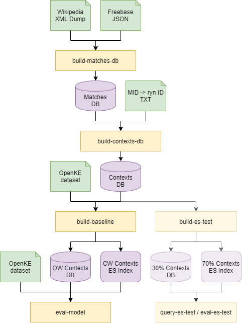

# Introduction

Knowledge graphs represent entities and their relationship to each other as a graph. The graph's nodes represent entities like *"Angela Merkel"* and *"Germany"*. The graph's directed edges represent relations between entities like *"is chancellor of"* which holds true for *"Angela Merkel"* and *"Germany"* as of 2020.

There are well maintained knowledge graphs for general knowledge as described in Wikipedia, for example. For specific domains, however, there are rarely comprehensive knowledge graphs because of the high effort to create them. However, the domain-specific entities are often known and there are large amounts of unstructured data such as texts describing the entities and their relationships.

This is referred to as an *open world scenario*: A knowledge graph exists for the known *closed world entities* and the relations between them. In addition, there are the known *open world entities*, whose relations are unknown. However, these relations can be derived from the existing, unstructured data that describes the open world entities.


# Project Scope

This project provides tools for setting up a baseline model that follows a primitive approach to predict an open world entity's triples: It looks up the closed world entity most similar to the open world entity using Elasticsearch, which uses TF-IDF as a measure of similarity, and assumes that the closed world entity's triples also apply to the open world entity. For example, if *"Emmanuel Macron"* is an open world entity whose most similar closed world entity is *"Angela Merkel"* for who the relation *"has profession"* towards the entity *"politician"* is true, the model assumes that this also applies to *"Emmanuel Macron"*.

Furthermore, the project contains an evaluation framework for comparing other models to the baseline, tools for running a grid search to find the best hyperparameters to train these models, as well as a browser UI that allows browsing the data.


# Setup

1. Make sure that you have at least 150GB of free disk space.

2. Clone the repository and mark the scripts as executable: <br>
   ```
   ~$ git clone https://gitlab.cs.hs-rm.de/tuhma001/sentence-sampler.git
   ~$ chmod +x sentence-sampler/bin/*.sh
   ```

3. Put `deepca` next to the `sentence-sampler` clone.
   ```
   ~$ ls
   deepca/
   sentence-sampler/
   ```

4. Optionally, set up a local Python environment. Run the following
   commands to set up a local Anaconda environment: <br>
   ```
   ~/sentence-sampler$ conda create -p ./envs python=3.7
   ~/sentence-sampler$ conda activate ./envs
   ```

5. Install the dependencies, including `deepca` from its editable
   source: <br>
   ```
   ~/sentence-sampler$ pip install -r requirements.txt
   ~/sentence-sampler$ pip install -e ../deepca
   ```

6. By default the data files are expected to be in a `data/`
   subdirectory:
   ```
   ~/sentence-sampler$ ls data/
   entity2wikidata.json
   enwiki-2018-09.full.xml
   enwiki-latest-pages-articles.xml
   ```

7. Set up Elasticsearch.

<hr> <!-- TODO -->

```
conda create -p conda/ python=3.8
conda activate conda/
pip install -e ../deepca/
pip install -r ../deepca/requirements/all.txt
pip install -e ../ryn/
pip install -r ../ryn/requirements.txt
pip install -r requirements.txt
python -m spacy download en_core_web_lg
```


# Commands Overview

The following diagram gives an overview how the available commands (yellow) are related and what documents (green) and databases are produced and consumed:



The upper part of the pipeline samples the Freebase entities' contexts in two steps:

- `build-matches-db` takes the `Wiki XML dump` and the `Freebase JSON `containing the mapping from the entities' Freebase MIDs to the respective Wikidata and produces the `Matches DB` that stores all matches of Freebase entities in the Wikipedia.
- `build-contexts-db` takes the matches from the `Matches DB` and samples a limited number of contexts for each entity. It also requires the `MID -> ryn ID TXT` mapping as it also stores the entities' ryn IDs. The result is the `Contexts DB`.

The expressiveness of the contexts in the `Contexts DB` can be tested by building and subsequently quering the "Elasticsearch test":

- `build-es-test` stores 30% of the contexts from the `Contexts DB` in a database and the other 70% in an Elasticsearch index.
- `query-es-test` is called with an entity that must be present in the `30% contexts DB` and queries the `70% Contexts ES Index` for the entity's contexts. The resulting entity should be similar to the query entity.
- `eval-es-test` queries the `70% Contexts ES Index` for all the entities from the `30% Contexts DB` and yields metrics that indicate the overall expressiveness of the contexts.

The lower part of the actual pipeline builds the baseline model from the `Contexts DB` which can then be queried:

- `build-baseline` splits the contexts from the `Contexts DB` into open and closed world entities using the information fromt the `OpenKE dataset`. As a result, the `OW Contexts DB` contains the contexts of the open world entities while the `CW Contexts ES Index` contains the contexts of the closed world entities.
- `eval-model` can be used to evaluate link prediction models, including the baseline model. `eval-model` generally requires the `OpenKE dataset` to differentiate between open and closed world entities. In order to be able to run the baseline model it furthermore requires the `OW Contexts DB` and the `CW Contexts ES Index` built by `build-baseline`.


Further information can be found in the wiki:
- [build-matches-db](../../wiki/Commands/build-matches-db)

## build-matches-db

## build-contexts-db

### Usage

```
usage: sam.py build-contexts-db [-h] [--random-seed RANDOM_SEED] [--context-size INT] [--crop-sentences] [--csv-file STR] [--limit-contexts INT] [--limit-entities INT] [--overwrite]
                                freebase-json matches-db contexts-db

Crop and store context for entity matches

positional arguments:
  freebase-json              Path to (input) Freebase JSON
  matches-db                 Path to (input) matches DB
  contexts-db                Path to (output) contexts DB

optional arguments:
  -h, --help                 show this help message and exit
  --random-seed RANDOM_SEED  Use together with PYTHONHASHSEED for reproducibility
  --context-size INT         Consider ... chars on each side of the entity mention (default: 100)
  --crop-sentences           Crop contexts at sentence boundaries (instead of token boundaries), sentences will be separated by new lines
  --csv-file STR             Log context stats to CSV file at path ... (default: None)
  --limit-contexts INT       Max number of contexts per entity (default: None)
  --limit-entities INT       Early stop after ... entities (default: None)
  --overwrite                Overwrite contexts DB and CSV file if they already exist
```

### Example

```bash
PYTHONPATH=src/ \
nohup python -u src/sam.py build-contexts-db \
  data/entity2wikidata.json \
  data/matches-v2-enwiki-20200920.db \
  data/contexts-v1-enwiki-20200920-100-500.db \
  --context-size 500 \
  --crop-sentences \
  --csv-file data/contexts-v1-enwiki-20200920-100-500.csv \
  --limit-contexts 100 \
> log/build-contexts-db_$(date +'%Y-%m-%d_%H-%M-%S').stdout &
```

## build-baseline

### Usage

```
usage: sam.py build-baseline [-h] [--random-seed RANDOM_SEED] [--es-host STR] [--limit-contexts INT] [--overwrite] contexts-db dataset-dir cw-es-index ow-contexts-db

Build closed world ES index and open world DB

positional arguments:
  contexts-db                Path to (input) contexts DB
  dataset-dir                Path to (input) OpenKE dataset directory
  cw-es-index                Name of (output) closed world Elasticsearch index
  ow-contexts-db             Path to (output) open world contexts DB

optional arguments:
  -h, --help                 show this help message and exit
  --random-seed RANDOM_SEED  Use together with PYTHONHASHSEED for reproducibility
  --es-host STR              Elasticsearch host (default: localhost:9200)
  --limit-contexts INT       Process only first ... contexts for each entity (default: None)
  --overwrite                Overwrite Elasticsearch index and contexts DB if they already exist
```

### Example

```bash
PYTHONPATH=src/ \
nohup python -u src/sam.py build-baseline \
  data/contexts-v1-enwiki-20200920-100-500.db \
  data/oke.fb15k237_30061990_50/ \
  cw-contexts-v1-enwiki-20200920-100-500 \
  data/ow-contexts-v1-enwiki-20200920-100-500.db \
  --limit-contexts 100 \
> log/build-baseline-100_$(date +'%Y-%m-%d_%H-%M-%S').stdout &
```

## eval-model

### Usage

```
usage: sam.py eval-model [-h] [--random-seed RANDOM_SEED] [--es-host STR] [--limit-entities INT] [--model STR] dataset-dir contexts-db

Evaluate model

positional arguments:
  dataset-dir                Path to (input) OpenKE dataset directory
  contexts-db                Path to (output) contexts DB

optional arguments:
  -h, --help                 show this help message and exit
  --random-seed RANDOM_SEED  Use together with PYTHONHASHSEED for reproducibility
  --es-host STR              Elasticsearch host (default: localhost:9200)
  --limit-entities INT       Process only first ... entities (default: None)
  --model STR                One of ['baseline-10', 'baseline-100'] (default: baseline-100)
```

### Example

```bash
PYTHONPATH=src/ \
nohup python -u src/sam.py eval-model \
  data/oke.fb15k237_30061990_50/ \
  data/ow-contexts-v1-enwiki-20200920-100-500.db \
  --model baseline-100 \
> log/eval-model-baseline-100_$(date +'%Y-%m-%d_%H-%M-%S').stdout &
```

## build-es-test

### Usage

```
usage: sam.py build-es-test [-h] [--random-seed RANDOM_SEED] [--es-host STR] [--limit-contexts INT] [--overwrite] [--verbose] contexts-db es-index test-contexts-db

Crop and store context for each entity match

positional arguments:
  contexts-db                Path to (input) contexts DB
  es-index                   Name of (output) Elasticsearch index
  test-contexts-db           Path to (output) test contexts DB

optional arguments:
  -h, --help                 show this help message and exit
  --random-seed RANDOM_SEED  Use together with PYTHONHASHSEED for reproducibility
  --es-host STR              Elasticsearch host (default: localhost:9200)
  --limit-contexts INT       Process only the first ... contexts for each entity (default: None)
  --overwrite                Overwrite Elasticsearch index and contexts DB if they already exist
  --verbose                  Print training contexts for each entity
```

### Example

```bash
PYTHONPATH=src/ \
nohup python -u src/sam.py build-es-test \
  data/contexts-v1-enwiki-20200920-100-500.db \
  cw-contexts-v1-enwiki-20200920-100-500 \
  data/ow-contexts-v1-enwiki-20200920-100-500.db \
  --limit-contexts 100 \
> log/build-es-test_$(date +'%Y-%m-%d_%H-%M-%S').stdout &
```

## query-es-test

### Usage

```
usage: sam.py query-es-test [-h] [--random-seed RANDOM_SEED] [--es-host STR] [--limit-contexts INT] [--limit-entities INT] [--top-hits INT] [--verbose] es-index test-contexts-db

Query Elasticsearch index for test contexts

positional arguments:
  es-index                   Name of (input) Elasticsearch index
  test-contexts-db           Path to (input) test contexts DB

optional arguments:
  -h, --help                 show this help message and exit
  --random-seed RANDOM_SEED  Use together with PYTHONHASHSEED for reproducibility
  --es-host STR              Elasticsearch host (default: localhost:9200)
  --limit-contexts INT       Process only first ... contexts for each entity (default: None)
  --limit-entities INT       Process only first ... entities (default: None)
  --top-hits INT             Evaluate only the top ... hits for each query (default: 10)
  --verbose                  Print query contexts for each entity
```

### Example

```bash
PYTHONPATH=src/ \
nohup python -u src/sam.py query-es-test \
  cw-contexts-v1-enwiki-20200920-100-500 \
  data/ow-contexts-v1-enwiki-20200920-100-500.db \
  --limit-entities 10 \
> log/query-es-test_$(date +'%Y-%m-%d_%H-%M-%S').stdout &
```

## eval-es-test

### Usage

```
usage: sam.py eval-es-test [-h] [--random-seed RANDOM_SEED] [--context-size INT] [--crop-sentences] [--limit-contexts INT] [--limit-entities INT] [--overwrite] matches-db contexts-db

Determine how closely linked contexts of different entities are

positional arguments:
  matches-db                 Path to (input) matches DB
  contexts-db                Path to (output) contexts DB

optional arguments:
  -h, --help                 show this help message and exit
  --random-seed RANDOM_SEED  Use together with PYTHONHASHSEED for reproducibility
  --context-size INT         Consider ... chars on each side of the entity mention (default: 100)
  --crop-sentences           Crop contexts at their sentence boundaries (instead of token boundaries)
  --limit-contexts INT       Process only first ... contexts for each entity (default: None)
  --limit-entities INT       Process only first ... entities (default: None)
  --overwrite                Overwrite contexts DB if it already exists
```


# Data Files

The example used in this documentation assume the following structure of the data directory:

```
data/
    oke.fb15k237_30061990_50/                   # OpenKE dataset directory
    contexts-v1-enwiki-20200920-100-500.db      # Contexts DB
    entity2wikidata.json                        # Freebase JSON
    enwiki-20200920.xml                         # Wiki XML dump
    matches-v2-enwiki-20200920.db               # Matches DB
```

Further details can be found in the wiki:
- [OpenKE Dataset Directory](../../wikis/Data-Files/OpenKE-Dataset-Directory)
- [Contexts DB](../../wikis/Data-Files/Contexts-DB)
- [Freebase JSON](../../wikis/Data-Files/Freebase-JSON)
- [Wiki XML Dump](../../wikis/Data-Files/Wiki-XML-Dump)
- [Matches DB](../../wikis/Data-Files/Matches-DB)


### Build the Baseline Model

Essentially, the baseline model consists of the closed world knowledge graph and the Elasticsearch index that stores text contexts for all the closed world entities. The knowledge graph must be given. This section shows how to build the Elasticsearch index. At the same time, contexts for the open world entities are sampled as well. They are stored in a database and are used later for prediction.

To be able to sample the text contexts of an entity, first the mentions of the entity in Wikipedia must be found. An entity can be described with different words. For example "Angela Merkel" could be mentioned by her name or as "the chancellor". For the text search we use the Wikidata label of the entity as well as all the link texts that are used to link the entity's Wikipedia article from other articles. We limit our search to adjacent Wikipedia articles because the search terms' meaning will often vary on distant Wikipedia articles. To know which articles are adjacent we build a link graph in the first step.

Thus, from start to finish, building the baseline model includes the following steps:
1. Build the link graph
2. Find an entity's matches in it's corresponding Wikipedia article and the adjacent articles
3. Sample contexts for the matches
4. Optionally, conduct a test experiment to verify the contexts' expressiveness
5. Concatenate the closed world entities' contexts and store them in the Elasticsearch index
6. Concatenate the open world entities' contexts and store them in a database
